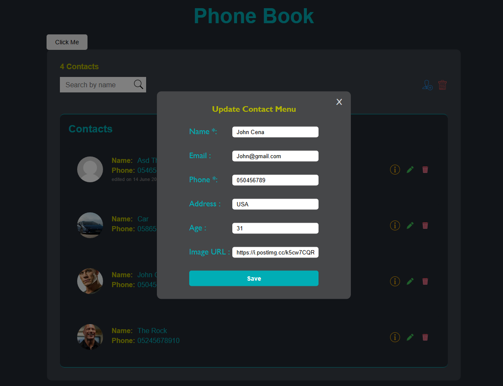

Technion Phone Book JavaScript Project

Duo names:

חסן עומר + עיסא לואבנה

---

## Site

https://hasanomar1.github.io/Technion-Project/

---

## About

We have been asked to create a phone book using JavaScript in duos as our JavaScript final project.

### Features

- Add contact
- Edit contact
- Delete contact
- Delete all contacts
- Search for contact
- Read about contact info
- Clicking on contact displays its info
- Edited at is shown when saving contact info after editing
- Each contact has Name,Email,Phone,Address,Age,Image (link)
- Name and Phone number are necessary when creating/editing contact
- Error msg if name and phone inputs are empty
- Error msg if name already exists
- Error msg if phone number is not valid (9-11 length for it to be valid)
- Error msg if Image link is not valid
- "Click me" button that displays an effect, clicking it again removes the effect
- Responsive website
- Proper message if no contacts are found
- One form for add and edit contact
- Contacts counter

---

#### Extra

##### Effect

The effect that is used is taken from this website

https://www.sliderrevolution.com/design/cool-javascript-animations/

##### Color Pallete

Color pallete is taken from from this website
https://colorhunt.co/palette/222831393e4600adb5eeeeee

---

##### Site Preview

